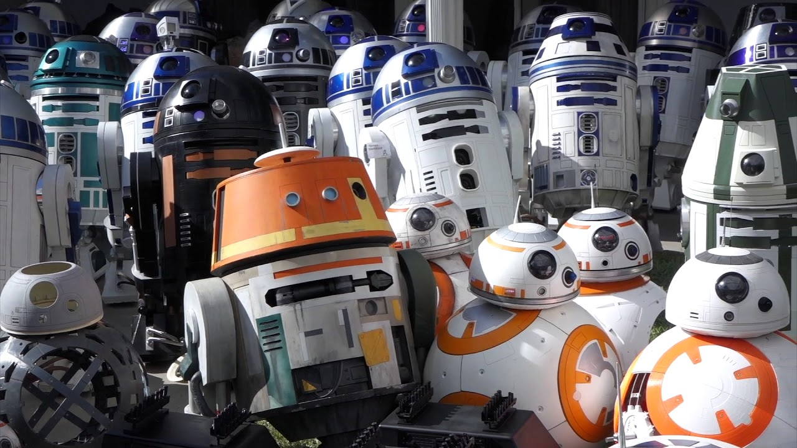

About 2 years ago something sparked up in my head and said: *“Wouldn't it be cool to start a blog”*. Since then I’ve debated in my head with questions like *“Do I even have enough time for this?”*, *“What would this blog even be about?”* and *“What’s the whole point of it?”*.

Well, today I’m finally taking the plunge and finally doing it! I decided for this blog to be a fusion of my interests while also keeping it streamlined. To keep it simple, the topic of my blog is going to be the passion of my life - **Robots**. In my opinion, they are one of the most complex technical inventions that we humans have created and they have endless potential that we are slowly beginning to tap into. My dream is for Star Wars-like robots to become the norm in our everyday-life (minus the blasters).

If you know your bots, you will also know that nothing is “simple” around them. Therefore, my blog will go into various topics around robots mostly focusing on coding, machine learning & AI, [ROS](https://www.ros.org/), and my hobby - [FPV quadcopters](http://www.imgeorgiev.com/projects/), sprinkled with a dash of [Formula Student](http://www.imgeorgiev.com/projects/), autonomous cars and a bit of my business mindset.

I am still nervous to start this but I think it would be lots of fun and I hope that somebody out there would find it useful!
