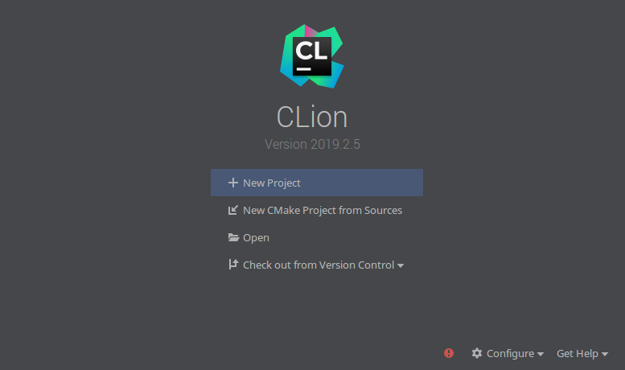
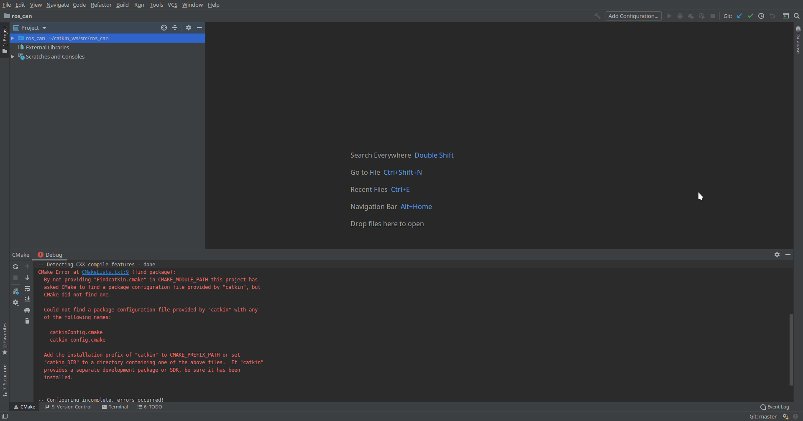
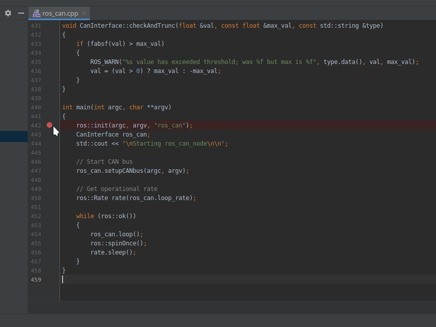
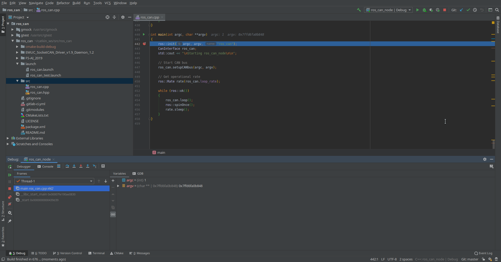
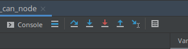
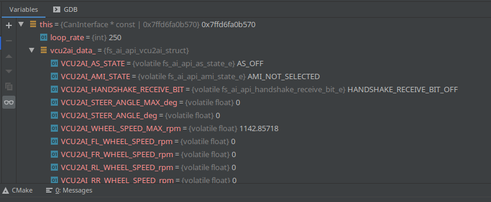

Throughout my time in robotics, I have noticed that not many people use debuggers when developing C++ for ROS. Reasons vary from "debuggers are useless when you run real robots" to "there are no good tools for that".

Well, debugging ROS is surprisingly easy, useful and very satisfying. In this short article, I’ll show you the basics of how to get started and get your hands dirty with some code!

## What is a debugger?

It is a tool that allows you to stop your program mid-execution and inspect important information such as where are you in the call stack, existing variables and their values, memory usage and probably most importantly, why did the program crash again?

The most popular debugger for C++ is [GDB](https://www.gnu.org/software/gdb/) but its command-line nature has a steep learning curve. Luckily, there are IDEs which offer graphical interfaces to the power of GDB!

## What is the right tool?

In many ways, we are limited by the [ROS build system](http://wiki.ros.org/catkin) which uses CMake. Here’s a shortlist of IDEs that support it natively:

- CLion
- QtCreator
- VSCode with plugins (free!)

Personally I like CLion the most as it works out of the box and is feature-rich, albeit not free and a bit heavy on memory.

So let’s dive straight into ROS debugging with CLion!

## Setup

[Download CLion](https://www.jetbrains.com/clion/download/) with a free 30-day trial. Pssst, it’s [free for students](https://www.jetbrains.com/student/)!

There is no installing per-say, you just have to unarchive it and run the executable. However, I’d suggest putting it into your root space.

```bash
cd Downloads
tar -xf CLion*
sudo mv clion* /opt/clion
```

That’s CLion done! Now let’s download some sample ROS code which we can play with. To showcase CLion’s capability to handle multiple custom ROS packages with interleaved dependencies, I’ll use one of my Formula Student teams’ repositories.

Let’s make a new ROS workspace for those purposes and download the necessary packages:

```bash
mkdir -p ~/catkin_ws/src
cd catkin_ws/src
git clone https://gitlab.com/eufs/ros_can --recursive
git clone https://gitlab.com/eufs/eufs_msgs
```

So we just downloaded 2 packages:

- `eufs_msgs` which is ROS package of custom ROS messages.
- `ros_can` which is a package that communicates with an autonomous car through a CAN interface. The key here is that this package uses the custom messages defined in `eufs_msgs`. Don’t worry you don’t need to do anything physical to get this to work.

We’re all set, let’s start CLion from the terminal and see how it looks!

```bash
/opt/clion/bin/clion.sh
```

Since this is the first time you’ve opened it, you’ll need to set up a profile and start your free trial. Once registered, you’ll see this screen



Click on Open and navigate to the `ros_can` package. Select it and click OK. Now we’ll see CLion in its full glory!



Hold on a moment, what is the big red text down below? That is your CMake window which tells you how CLion is reading the CMakeLists file of the project. Here though, it doesn’t seem very happy. The issue is that it can’t find the ROS build system. That is because we actually haven’t sourced ROS in the terminal from which we opened CLion. In different words, CLion doesn’t know of ROS and doesn’t know where to find its binaries.

NB. Depending on your setup CLion might have found the ROS libraries but it definitely shouldn’t have found `eufs_msgs`.

To fix this issue, we need to close CLion, get back to the terminal and build both `eufs_msgs` and `ros_can`. You can do that by just doing `catkin_make`. Not that you also need to have ROS sourced for this. After you build the packages make sure you source your workspace and then open CLion the same way we did before:

```bash
cd ~/catkin_ws/
catkin_make
source devel/setup.bash
/opt/clion/bin/clion.sh
```

Now you shouldn’t see any red text and CLion should work as expected!

## Debugging

By default CLion uses its own custom build and debug directories which don’t match the ROS ones. We’ll need to configure CLion to build code in the place where ROS expects it. To do this go to **File > Settings > Build, Execution, Deployment > CMake** and change two fields:

- In Generation path, set `/home/[user]/catkin_ws/build`.
- In CMake options, add `-DCATKIN_DEVEL_PREFIX:PATH=/home/[user]/catkin_ws/devel`

Now, let’s build the code with debugging enabled! Just press the green hammer icon (🔨) on the top right of the window.

Next step is to identify some code we want to inspect. Let’s start off with the simplest thing - the `main()` of our only ROS node. Within CLion, open the `src/ros_can.cpp` file and find the main function on line 440. It should look like this:

```cpp
int main(int argc, char **argv)
{
   ros::init(argc, argv, "ros_can");
   CanInterface ros_can;
   std::cout << "\nStarting ros_can_node\n\n";

   // Start CAN bus
   ros_can.setupCANbus(argc, argv);

   // Get operational rate
   ros::Rate rate(ros_can.loop_rate);

   while (ros::ok())
   {
       ros_can.loop();
       ros::spinOnce();
       rate.sleep();
   }
}
```

Without going into too much detail, the first 3 lines start up the ROS node. Then the `setupCANbus` function initialises the CAN connection and finally the `while` loop just runs at a predefined rate and calls `ros_can.loop()` where all of the magic happens. For this example, let’s set a [breakpoint](https://en.wikipedia.org/wiki/Breakpoint) at the beginning of the main. A breakpoint tells the debugger when to interrupt the code execution and give you command of it.

You can set a breakpoint by clicking on the right-hand side of the line number. Click next to line 442 and a red dot should appear like in the picture below. This is your confirmation.



Let’s now launch `ros_can` with a testing launch file and see. On the bottom of the CLion window, you should see a **Terminal** tab which is simply a normal terminal that you can use directly from CLion. From there you can do all of your normal ROS commands so let’s do a roslaunch!

```bash
  roslaunch ros_can ros_can_test.launch
```

You should see a message saying **Simulating CAN data**. Now we’re finally ready to start debugging. Press the green bug icon on the top right corner.

Your layout should change to something like this:



Three things have changed in the layout:

1. The text editing bit has highlighted the code line on which you are currently.
2. The bottom right tab shows you the callback stack.
3. The bottom left tab shows you the variables currently in scope along with their values.

Now we can continue navigating the code using the debugger navigation controls above the bottom right tab.



The two basic ones are:

- **Step over** - continues to the next line of code in the program you are currently in.
- **Step into** - if you are currently at a function call, step into will go inside the function (potentially into another file)

Let’s say we are interested in `ros_can.loop()`. Use **Step over** several times until the text editor highlights that line and then click **Step into**. Afterwards, you should get brought up to line 86 which is the beginning of the `int CanInterface::loop()` function

Click **Step over** a couple of more times and you should accumulate some variables to inspect. Expand **this** in the bottom right tab and you should be able to browse around the variables and inspect their numbers.



That about concludes this short introduction to debugging ROS C++ code.

## Going further

- [this blog post](https://blog.jetbrains.com/clion/2015/05/debug-clion/) would be a nice place to learn more about debuggers
- if you want to get the most out of CLion + ROS, you can get [some nice plugins](http://wiki.ros.org/IDEs#CLion) to support your development
