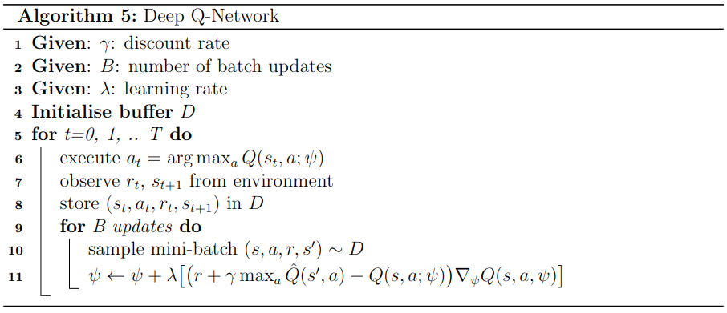

**DISCLAIMER: This is a public draft under review; If you have any comments or suggestions, [shoot me an email](mailto:ignat@imgeorgiev.com)!**

Soft Actor Critic (SAC) is a model-free Reinforcement Learning (RL)
method developed by Tuomas Haarnoja in a series of papers culminating
in [Soft Actor-Critic Algorithms and Applications](https://arxiv.org/pdf/1812.05905).
It is in my opinion one of the seminal RL papers for continuous control
and has inspired a gread deal of my work.

In this blog post I'll go over the theory and derivation behind SAC,
from zero to a fully-derived algorithm without skipping (almost) any 
of the mathematical details. This time I haven't included an implmentation
of my own, but a good one to go along with this blog post is [denisyarats/pytorch_sac](https://github.com/denisyarats/pytorch_sac).

*Note: If you are familiar with RL basics, feel free to skip ahead*

**Table of contents**
* TOC
{:toc}

Problem
=================
We want a robot with limited perceptive abilities to learn to achieve
a given task. Let's formulate this mathematically and ground it in 
the real world via a beer opening robot:

* The world has a state at a given time $s_t \in S$. This state space
can consist of anything meaningful to the robot: the position of the
beer bottle? how full is it? how thursty is the human we need to serve?
* Unfortunately, robots can't open beer bottles by just thinking about
it really hard, instead they have to act in the world via actions $a_t \in A$.
For our robot, actions could be a 4-dimensional torque vector to control all
joints of the robot arm.
* To incentivise the robot to achieve its goal, we give it a reward for each
timestep $r_t \in \mathbb{R}$. This could be a function of the state and action
$r_t := r(s_t, a_t)$ or could be something more abstract like our human
telling us how happy he/she is. The key assumption is that the robot only
gets a scalar reward $r_t$ at each timestep without knowing how it is calculated.

The goal of our agent now is to maximize the cumulative reward by chosing the optimal sequence of actions:

$$ \max_{a_0, a_1, ..., a_T} \sum_{t=0}^T r_t $$

Note on horizons

To be precise this is called a finite-horizon problem as we are only considering rewards up to a fixed timestep T. Naturally this has its limitations and often we want to consider infinite horizon problems. Although most of the content of this blog applies to such problems, the theory is more difficult to develop.

Technically our reward can depend on a number of factors from previous
timesteps (e.g. did the human think I look cool while opening his/her beer). However, that quickly becomes an exponentially harder problem, especially from a theoretical sense. To make the problem more tractable and our lives easier, we will make an assumption:

**Assumption 1**: Given a sequence of state-action pairs $(s_t, a_t) \ \ \ \forall t \in [0, T]$, the transition distribution is fully defined by $p(s_{t+1} | s_t, a_t)$. This is known as the [Markov Assumption](https://en.wikipedia.org/wiki/Markov_property).

In English: the last state $s_t$ contains all the useful information for our problem. From this we automatically get

<a id="reward_corollary">Corollary 1</a> : The reward is defined as $r: S \times A \rightarrow \mathbb{R}$

Visually this can be look as the following Markov Chain:

With this assumption we can now redefine our [objective function](#base_objective) as

$$ \max_{a_0, a_1, ..., a_T} \sum_{t=0}^T r(s_t, a_t) $$

Still, this is incorrectly defined. Why? Because we defined our transition dynamics as a probabilistic distribution in [Assumption 1](#markov_assumption). To tackle that we have to define our objective above as an expectation over the rewards:

$$ \begin{equation} \max_{a_0, a_1, ..., a_T} \sum_{t=0}^T \mathbb{E}_{s_{t+1} \sim p(s_{t} | s_{t-1}, a_{t-1})} \big[ r(s_t, a_t) \big] \end{equation} $$

Since we're already dealing with probabilistic distributions and ultimately want our results to fit in modern machine learning, we can constrain our actions to be coming from a set of possible policies:

**Assumption 2**: Actions are sampled from a probabilistic feedback policy $\pi$ parametarised by $\theta \in \mathbb{R}^d$ and conditioned only on the current state $s_t$:

$$a_t \sim \pi(a_t | s_t; \theta) $$

Thus our final (and I mean it this time) objective becomes

$$ \begin{equation} \max_{a_0, a_1, ..., a_T} \sum_{t=0}^T \mathbb{E}_{s_{t+1} \sim p(s_{t} | s_{t-1}, a_{t-1}) \atop a_t \sim \pi(a_t | s_t; \theta)} \big[ r(s_t, a_t) \big] \end{equation} $$

# Bellman Equations

These problems get really messy really fast. Luckily we have a simple unified way to think about these problmes - via the lens of value functions:

**Definition 1**: The value of a state $s_t$ following policy $\pi$ is given by

$$ \begin{equation} V^\pi(s_t) = \sum_{n=t}^T \mathbb{E}_{s_{n+1} \sim p(s_{n} | s_{n-1}, a_{n-1}) \atop a_n \sim \pi(a_n | s_n; \theta)} \big[ r(s_n, a_n) \big] \end{equation} $$

English: This is the reward we expect to receive continuing from our current state $s_t$. We will refer to this as the **value function**.

Let's expand this and see where we end up

$$ \begin{align} V^\pi(s_t) & = \notag \sum_{n=t}^T \mathbb{E}_{s_{n+1} \sim p(s_{n} | s_{n-1}, a_{n-1}) \atop a_n \sim \pi(a_n | s_n; \theta)} \big[ r(s_n, a_n) \big] \\
&= \notag \mathbb{E}_{a_t \sim \pi(a_t | s_t; \theta)} \bigg[ r(s_t, a_t) + \sum_{n=t+1}^T \mathbb{E}_{s_{n+1} \sim p(s_{n} | s_{n-1}, a_{n-1}) \atop a_n \sim \pi(a_n | s_n; \theta)} \big[ r(s_n, a_n) \big] \bigg] \\
&= \mathbb{E}_{a_t \sim \pi(a_t | s_t; \theta)} \bigg[ r(s_t, a_t) + \mathbb{E}_{s_{t+1} \sim p(s_{t+1} | s_{t}, a_{t})} \big[ V^\pi (s_{t+1}) \big] \bigg] \end{align} $$

This recursive relationship is known as the **Bellman Equation** and will be key to our future derivations.

There is also another way to look at our [value function from Definition 1](#value_func) through the lens of an already taken action:

**Definition 2**: The value of a state-action pair $(s_t, a_t)$ following policy $\pi$ is given by:

$$ \begin{equation} Q^\pi(s_t, a_t) = r(s_t, a_t) + \sum_{n=t+1}^T \mathbb{E}_{s_n \sim p(s_{n} | s_{n-1}, a_{n-1}) \atop a_n \sim \pi(a_n | s_n; \theta)} \big[ r(s_n, a_n) \big] \end{equation} $$

We will refer to this as the **state-action value function** or **Q function**.

Similarly to value function, here we also have a recursive relationship:

$$ \begin{aligned} Q^\pi(s_t, a_t) &= r(s_t, a_t) + \sum_{n=t+1}^T \mathbb{E}_{s_{n} \sim p(s_{n} | s_{n-1}, a_{n-1}) \atop a_n \sim \pi(a_n | s_n; \theta)} \big[ r(s_n, a_n) \big] \\
&= Q^\pi(s_t, a_t) = r(s_t, a_t) + \mathbb{E}_{s_{t+1} \sim p(s_{t+1} | s_{t}, a_{t}) \atop a_{t+1} \sim \pi(a_{t+1} | s_{t+1}; \theta)} \big[ Q^\pi (s_{t+1}, a_{t+1}) \big] \end{aligned} $$

Additionally note the relationship between $V(s_t)$ and $Q(s_t, a_t)$:

$$ \begin{equation} Q^\pi (s_t, a_t) = r(s_t, a_t) + \mathbb{E}_{s_{t+1} \sim p(s_{t+1} | s_{t}, a_{t})} \big[ V^\pi (s_{t+1}) \big] \end{equation} $$

TD Learning
==================================
Cool but what can we use these value functions for? Let's consider the problem of traversing a graph with the highest possible cumulative reward. We don't select actions, we only transition according to the probabilities in the graph below. Reward is $r(s_6) = 0$ and $r(s) = -1 \ \ \ \forall s \neq s_6$.

One way to solve this is via Dynamic Porgramming (DP). You can read more about it in my other [blog post about Diffrential Dynamic Programming](http://www.imgeorgiev.com/2023-02-01-ddp/#dynamic-programming-dp). What we need to know for now though is that we simply need to apply the [Bellman Equation (Eq. 4)](#recursive_value_func) recursively to all states going from left to right:

$$ \begin{aligned} V(s_6) &= 0 && \text{terminal state} \\
V(s_5) &= -1 + p(s_6 | s_5)V(s_6) + p(s_5|s_5)V(s_5) \\
&= -1 + 0.8 \cdot 0 + 0.2 V(s_5) \\
&= \dfrac{-1}{0.8} = -1.25 \\
V(s_4) &= -1 + 1.0 V(s_6) = -1 \\
V(s_3) &= -1 + 0.6 V(s_6) + 0.4 V(s_3) \\
&= -1 + 0.6 \cdot 0 + 0.4 V(s_3) \\
&= \dfrac{-1}{0.6} = -1 \dfrac{2}{3} \\
V(s_2) &= -1 + 0.2 V(s_4) + 0.8 V(s_5) \\
&= -1 -0.2 -0.8 \cdot 1.25 = -2.2 \\
V(s_1) &= -1 +0.4 V(s_3) + 0.6 V(s_4) \\
&= -1 -0.4 \cdot 1\dfrac{2}{3} - 0.6 \approx -2.2667 \end{aligned} $$

Thus, by following the path of highest values we can conclude that the best path is $s_2 \rightarrow s_4 \rightarrow s_6$. This is the power of value functions and how they allow us to estimate optimality and make decisions (well, in this example we don't actually decide).

We say that Dynamic Programming (DP):

* does **full backups** as it considers all possible transitions in [Eq. 4](#recursive_value_func). This works only for small problems.
* **bootstraps** as it uses other value estimates to update its own new estimates.

If we don't want to bootstrap, we can isntead use **Monte Carlo (MC)** samples to update our value estimates based on the full return of some sampled trajectories. In other words, we take multiple samples of [Eq. 2](#value_func) and use them to update our $V(s)$ estimates for all visited states $s$.

The full return in our toy example invovles reaching the last termination state. We call this an **episode**.

There are multiple ways to MC estimates. The easiest one is first-visit MC where we use the return following the first visit.

Using the same toy graph as above, say we are given 4 episodes:

1. $s_1 \rightarrow s_3 \rightarrow s_3 \rightarrow s_6$
   * results in $V(s_1) = -3$, $V(s_3)=-2$, $V(s_6)=0$
2. $s_2 \rightarrow s_4 \rightarrow s_6$
   * results in $V(s_2) = -2$, $V(s_4) = -1$, $V(s_6) = 0$ 
3. $s_2 \rightarrow s_5 \rightarrow s_6$
   * results in $V(s_2) = -2$, $V(s_5) = -1$, $V(s_6) = 0$
4. $s_2 \rightarrow s_5 \rightarrow s_5 \rightarrow s_6$
   * results in $V(s_2) = -3$, $V(s_5) = -2$, $V(s_6) = 0$

If we average out all the samples we get:

$$\begin{aligned} V(s_6) &= (0 + 0 + 0 + 0)/4 = 0 \\
V(s_5) &= (-1 - 2)/2 = -1.5 \\
V(s_4) &= -1 / 1= -1 \\
V(s_3) &= -2/1 = -2 \\
V(s_2) &= (-2 -2 -3)/3 = -2 \dfrac{1}{3} \\
V(s_1) &= -3/1 = -3
\end{aligned}$$

Comparing these values to what we obtained in DP, we can see that they aren't entirely correct but are close. If we have infinite MC samples, we would get the DP results according to the [Weak Law of Large Numbers (WLLN)](https://en.wikipedia.org/wiki/Law_of_large_numbers). However, even with these 4 samples, we can still conclude that $s_2 \rightarrow s_4 \rightarrow s_6$ is the optimal path.

What is quite cool about MC is that we don't need a model (i.e. it is model-free)! A not so cool thing is that we need to wait for episodes to finish before we can update our value estimates.

If we don't want to wait until the end, we can use 1-step MC samples and bootstrap the rest:

$$ V(s_t) \leftarrow V(s_t) + \alpha(\hat{V}(s_{t}) - V(s_t)) $$

where $\alpha$ is an update step and $\hat{V}(s_t)$ is our new estiamte for $V(s_t)$ (that we're not fully certain of; that's why we call it estimate). OK, but how can we get an estimate? We can use the definition of the value function from [Eq. 2](#value_func) but then we still need to wait for the outcome of the episode. In [Eq. 3](#recursive_value_func) we discovered an interesting recursive relationship that only considers one step in the future. Swapping in that we get a new update rule:

$$ \begin{equation} V(s_t) \leftarrow V(s_t) + \alpha \bigg( \mathbb{E}_{a_t \sim \pi (a_t | s_t; \theta)} \bigg[ r(s_t, a_t) + \mathbb{E}_{s_{t+1} \sim p(s_{t+1} | s_{t})} \big[ V (s_{t+1}) \big] \bigg] - V(s_t) \bigg) \end{equation} $$

Thus, now we have an update rule that we just need to wait 1 timestep before applying! Note that we removed all remnats of $\pi$ and $a_t$ since we aren't executing actions in this toy example.

This is called **Temporal Difference (TD) Learning** and because we use only a single step sample, this particular update is called a **TD(0)** update. This is a cross between DP and MC trying to harness the benefits of both. We can frequently update our estimates like DP by **bootstrapping** but also doing so in a **model-free** fashion like MC!

TD-Learning is considered by many the core of RL! Armed with [Eq. 5](#td_udpate), we can conceive a simple value estimator algorithm for our toy problem.

TODO: update algorithm with my notation

Let's apply this to our toy problem. Initialise $V(s) = 0 \ \ \forall s$, $\alpha = 0.5$, $\gamma = 1$.

1. $s_1 \rightarrow s_3 \rightarrow s_3 \rightarrow s_6$
   * $V(s_1) = V(s_1) + 0.5(-1+V(s_3)-V(s_1)) = -0.5$
   * $V(s_3) = V(s_3) + 0.5(-1+V(s_3)-V(s_3)) = -0.5$
   * $V(s_3) = V(s_3) + 0.5(-1+V(s_6)-V(s_3)) = -0.75$
   * $V(s_6) = V(s_6) = 0$
2. $s_2 \rightarrow s_4 \rightarrow s_6$
   * $V(s_2) = V(s_2) + 0.5(-1 + V(s_4) - V(s_2)) = -0.5$ 
   * $V(s_4) = V(s_4) + 0.5(-1 + V(s_6) - V(s_4)) = -0.5$ 
   * $V(s_6) = V(s_6) = 0$
3. $s_2 \rightarrow s_5 \rightarrow s_6$
   * $V(s_2) = V(s_2) + 0.5(-1 + V(s_5) - V(s_2)) = -0.75$ 
   * $V(s_5) = V(s_5) + 0.5(-1 + V(s_6) - V(s_5)) = -0.5$ 
   * $V(s_6) = V(s_6) = 0$
4. $s_2 \rightarrow s_5 \rightarrow s_5 \rightarrow s_6$
   * $V(s_2) = V(s_2) + 0.5(-1 + V(s_5) - V(s_2)) = -1.125$ 
   * $V(s_5) = V(s_5) + 0.5(-1 + V(s_5) - V(s_5)) = -1$ 
   * $V(s_5) = V(s_5) + 0.5(-1 + V(s_6) - V(s_5)) = -1$ 
   * $V(s_6) = V(s_6) = 0$

Oh wow, we got the almost optimal path again! Let's compare all of our value estimates from the different methods

|          | DP     | MC     | TD(0)  |
| -------- | ------ | ------ | ------ |
| $V(s_1)$ | 2.667  | -3     | -0.5   |
| $V(s_2)$ | -2.2   | -2.333 | -1.125 |
| $V(s_3)$ | -1.667 | -1.0   | -0.75  |
| $V(s_4)$ | -1.0   | -1.0   | -0.5   |
| $V(s_5)$ | -1.25  | -1.5   | -1.0   |
| $V(s_6)$ | 0.0    | 0.0    | 0.0    |

TD(0) didn't do too badly! With more samples and more tuned $\alpha$ it can do even better! (Hint: try $\alpha=0.8$)
 
Q-Learning
=========================
TD-Learning is nice and all but in the toy example above we didn't have a policy and thus an opportunity to take actions. If we had the option, can we use TD-Learning to learn a policy?

One way is to take our TD(0) update from [Eq. 6](#td0_udpate) and reformulate it with state-action values instead:

$$ \begin{equation} Q(s_t, a_t) \leftarrow Q(s_t, a_t) + \alpha( r(s_t, a_t) + \mathbb{E}_{s_{t+1} \sim p(s_{t+1} | s_{t}, a_t) \atop a_t \sim \pi (a_t | s_t; \theta)} \big[ Q (s_{t+1}, a_{t+1}) \big] - Q(s_t, a_t)) \end{equation} $$

OK, how the select actions? The most naive way is by iterating over all actions to find the one with the highest value. Assuming a discrete and finite action space $A = \mathbb{N}^m$, then it is feasible to compute this.

$$ a_t = \max_a Q(s_t, a) $$

Let's for a moment say we can feasibly compute this, then why should we compute the expected value of $Q(s_{t+1}, a_{t+1})$ in [Eq. 7](#td0_q_update), why don't we directly optimize Q there which is guaranteed to lead to the optimal Q-value! Wait, what is the optimal Q-value?

**Definition 3**: The optimal value function $V^*(s)$ or $Q^*(s,a)$ is the value of following the optimal policy $\pi^*$ that achieves the highest possible reward on our task: $\forall s \in S, \forall \pi \neq \pi^*$ the following inequality holds $V^*(s) \geq V^\pi(s)$

Thus we can now reformulate [Eq. 7](#td0_q_update) to always follow the (currently) optimal action, not just to blindly use the sampled action:

$$ \begin{equation} Q(s_t, a_t) \leftarrow Q(s_t, a_t) + \alpha( r(s_t, a_t) + \mathbb{E}_{s_{t+1} \sim p(s_{t+1} | s_{t}, a_t)} \big[ \max_a Q (s_{t+1}, a) \big] - Q(s_t, a_t)) \end{equation} $$

For completeness and references to other literature, using [Eq. 7](#td0_update) to update value estimates is known as SARSA and using [Eq. 8](#q_learning_udpate) is known as Q-Learning. These two update rules represent on-policy and off-policy learning respectively, which are two different schools in the RL community. On-policy updates have nice theoretical guarantees and in practice result in faster convergence but requires us to learn from the current policy interacting with the environment. While off-policy approaches allow us to learn from any data and have better exploration but worse theoretical convergence guarantees.

OK, let's get to something practical - how do we use Q-learning to solve interesting tasks?

When Q is parametarised with a neural net, we arrive at the first successful deep RL algorithm - [Deep Q-Network (DQN)](https://arxiv.org/pdf/1312.5602). In that paper, the authors parametarise the Q-value neural net with some parameters $\psi$ and train it to the loss function

$$\min_\psi \dfrac{1}{2} \big( r(s_t, a_t) + \gamma \max_a \hat{Q}(s_{t+1}, a) - Q(s_t, a_t; \psi)  \big)^2 $$

which results in the update rule

$$ \psi \leftarrow \psi + \alpha \big( r(s_t, a_t) + \gamma \max_a \hat{Q}(s_{t+1}, a) - Q(s_t, a_t; \psi)  \big) \nabla_\psi Q(s_t, a_t; \psi)$$

Okay, but from where do we get the data to train on $(s_t, a_t, r_t, s_{t+1})$? With TD(0) we can learn from 1-step interactions, so we can do step, learn, step, learn and etc... However, NNs aren't great at learning from a single data point; matter of fact they only work when trained with [Stochastic Gradient Descent (SGD)](https://en.wikipedia.org/wiki/Stochastic_gradient_descent). To make NNs work for Q-Learning, Mnih et al. introduce the concept of an experience replay buffer - a dataset containing the M latest interactions. If M is large enough (e.g. $10^6$), we can sample mini-batches from it and train our Q-network. Thus, we arrive at the famous DQN algorithm!

DQN details

OK, so I ommited some unimportant details regarding DQN:

1. What is $\gamma$? That is the discount rate, which we usually set to a number close to 1 like 0.99. We use it to discount the value of future rewards when we add it in the objective like $\sum_{t=0}^T \gamma^t r_t.
2. What is $\hat{Q}$? That is a "target network" which is a copy of our normal Q-network except that we don't backpropagate through it and that its parameters are lagging behind the main network by a few updates.
3. DQN also uses $\epsilon$-greedy exploration where each timestep with some probabiliy the robot takes a random action. This is solely for adding naive exploration into the algorithm.
4. DQN also has the concept of a terminal value where instead of trying to minimise towards a target $r_t + \gamma \hat{Q}(s_t, a_t)$, we instead say that the episode terminates and we only minimise towards target $r_t$.

For all the details check the [original paper](https://arxiv.org/pdf/1312.5602)!

Policy Gradients
===================================

Q-learning is cool and works for deterministic action spaces but let us now return to continuous action spaces $a_t \in A = R^d$. Finding $\max_a Q(s_t, a)$ becomes infeasibile. Even worse, as we increase $d$, we quickly run into the [curse of dimensionality](https://en.wikipedia.org/wiki/Curse_of_dimensionality).

Let's completely disregard Q-learning and go back to having a parametarised policy $\pi(a, s; \theta)$ and optimize it to try to solve our base objective from [Eq. 1](#base_objective_3). We can explicitly frame thias as

$$ \begin{equation} \max_{\theta} J(\theta) = \max_\theta  \mathbb{E}_{s_{t+1} \sim p(s_{t+1} | s_{t}, a_{t}) \atop a_t \sim \pi(a_t | s_t; \theta)} \bigg[ \sum_{t=0}^T r(s_t, a_t) \bigg] \end{equation} $$

**Theorem 1**: Policy Gradients (for finite horizon)

If our starting state follows some distribution $p(s_0)$, the gradient of the objective in [Eq. 10](#policy_grad_obj) is

$$ \begin{equation} \nabla_\theta J(\theta) = \mathbb{E}_{s_{t+1} \sim p(s_{t+1} | s_{t}, a_{t}) \atop a_t \sim \pi(a_t | s_t; \theta)} \bigg[ \sum_{t=0}^T r(s_t, a_t) \nabla_\theta \log \pi (a_t | s_t; \theta) \bigg] \end{equation}$$

Pretty cool eh? This tells us that to optimize our objective, we don't need to differentiate neither the reward, nor the model! This keeps up with our initial assumptions that we have no information about them.

**Proof:**

The key to the proof is the log-prob trick using the simple calculus identity

$$ \nabla_x log f(x) = \dfrac{1}{f(x)} \nabla_x f(x) $$

$$ \nabla_x f(x) = f(x) \nabla_x \log f(x)$$

If we apply this directly to [Eq. 10](#policy_grad_obj) we get

$$\begin{equation} \nabla_\theta J (\theta) = J(\theta) \nabla_\theta \log J (\theta) \end{equation} $$

Now, this is useful only if finding $\nabla_\theta \log J(\theta)$ is easy. Let's check that

$$ \begin{aligned} J(\theta) &= \max_\theta  \mathbb{E}_{s_{t+1} \sim p(s_{t} | s_{t-1}, a_{t-1}) \atop a_t \sim \pi(a_t | s_t; \theta)} \bigg[ \sum_{t=0}^T r(s_t, a_t) \bigg]\\
&= \bigg[ \sum_{t=0}^T r(s_t, a_t) \bigg] \bigg[ \int_{s_0} p(s_0) \int_{a_0} \pi(a_0 | s_0; \theta) \int_{s_1} p(s_1|s_0, a_0) \int_{a_1} \pi (a_1 | s_1; \theta) \int_{s_2} p(s_2|s_1, a_1) ... \bigg] \\
&= \underbrace{\bigg[ \sum_{t=0}^T r(s_t, a_t) \bigg]}_\text{trajectory sample} \underbrace{\bigg[ \int_{s_0} p(s_0) \prod_{t=0}^T \int_{s_t} p(s_t| s_{t-1}, a_{t-1}) \int_{a_t} \pi (a_t | s_t; \theta) \bigg]}_\text{probability of trajectory sample} \end{aligned}$$

Where

$$p(s_0| s_{-1}, a_{-1}) = 1$$

Let's now take the log of the whole expression above

$$ \log J(\theta) = \log \sum_{t=0}^T r(s_t, a_t) + \log \int_{s_0} p(s_0) +  \sum_{t=0}^T \big[ \log \int_{s_t} p(s_t| s_{t-1}, a_{t-1}) + \log \int_{a_t} \pi(a_t|s_t; \theta) \big] $$

Now taking the gradient of the whole expression, we see that most terms go away as they aren't a function of $\theta$

$$ \begin{aligned} \nabla \log J(\theta) &= \nabla_\theta \sum_{t=0}^T \log \int_{a_t} \pi (a_t|s_t; \theta) \\ &= \mathbb{E}_{s_{t+1} \sim p(s_{t+1} | s_{t}, a_{t}) \atop a_t \sim \pi(a_t | s_t; \theta)} \bigg[ \sum_{t=0}^T \nabla_\theta \log \pi(a_t|s_t; \theta) \bigg] \end{aligned} $$

Plugging this directly into [Eq. 11](#j_intermid)

$$ \begin{aligned} \nabla_\theta J(\theta) &= J(\theta) \nabla_\theta \log J(\theta) \\
&= \mathbb{E}_{s_{t+1} \sim p(s_{t+1} | s_{t}, a_{t}) \atop a_t \sim \pi(a_t | s_t; \theta)} \bigg[\sum_{t=0}^T r(s_t, a_t) \bigg] \mathbb{E}_{s_{t+1} \sim p(s_{t+1} | s_{t}, a_{t}) \atop a_t \sim \pi(a_t | s_t; \theta)} \bigg[ \sum_{t=0}^T \nabla_\theta \log \pi(a_t | s_t; \theta) \bigg] \\
&= \mathbb{E}_{s_{t+1} \sim p(s_{t+1} | s_{t}, a_{t}) \atop a_t \sim \pi(a_t | s_t; \theta)} \bigg[ \sum_{t=0}^T r(s_t, a_t) \nabla_\theta \log \pi (a_t| s_t; \theta) \bigg] \end{aligned} $$

Credits: I pieced together this proof from [Sutton's Chapter 13](http://incompleteideas.net/book/bookdraft2017nov5.pdf) and [Tedrake's Chapter 20](http://underactuated.mit.edu/rl_policy_search.html).

> Note: There are many other flavours of proofs for this theorem. One that you might find interesting to figure out is the infinite time-horizon one.

We just developed this theory of how we can optimize our objective, what now? Can we just apply it to our problems and solve them? No, not really. Policy gradients (PG) methods are very useful but they can't figure out long-term results of their actions - i.e. we just optimized to state $s_T$ but is that a good state to be in? Maybe it is in the short term but it might not be in the long term. I love giving the example of the drunken spidere who had too much beer at the pub and is now trying to get home

He is drunk so his movement is uncertain (i.e. stochastic) and his planning horizon is severly limited. Matter of fact he is so drunk he can only plan as much as point A and B. If we leave the spider to decide based on PG with a simple reward like closest distance to home, it will decide that point A is better. However, then the spider has to cross the bridge and if he stumbles he will fall into the lake which I would imagine has a pretty bad reward. Thus, getting to state B is better, but PG lacks the foresight to decide this due to their limited time horizon.

Actor critic methods
==========================

In a nuthsell, actor-critic methods address the limitations of PG (lack of foresight) and Q-learning (inability to scale to continuous action spaces) by combining both ideas into one uniform framework called **actor-critic methods**. In a nuthsell, they have three major components:
1. A $\psi$-parametarised **critic** that lears a $Q(s,a; \psi)$ state-action value estimator based on Q-learning. We use our standard [Eq. 8](#q_learning_udpate) but now we get our optimal action from $$a_t \sim \pi(a_t | s_t; \theta)$$. Thus our loss and update equations are now:

$$\min_\psi \dfrac{1}{2} \big( r(s_t, a_t) + \gamma \mathbb{E}_{a \sim \pi(a|s_{t+1}; \theta)} [\hat{Q}(s_{t+1}, a)] - Q(s_t, a_t; \psi)  \big)^2 $$

$$ \psi \leftarrow \psi + \alpha \big( r(s_t, a_t) + \gamma \mathbb{E}_{a \sim \pi(a|s_{t+1}; \theta)} [\hat{Q}(s_{t+1}, a)] - Q(s_t, a_t; \psi)  \big) \nabla_\psi Q(s_t, a_t; \psi)$$

2. A $\theta$-parametarised **actor** which learns according to our [PG theorem Eq. 10](#policy_grad). The key here is that instead of optimizing for maximal reward, we can optimize for the surrogate of the reward, the Q-function!

$$\max_\theta \mathbb{E}_{a \sim \pi(a_t|s_t; \theta)} [Q(s_t, a_t)]$$

$$ \theta \leftarrow \theta + \alpha \big( \mathbb{E}_{a \sim \pi(a_t|s_t; \theta)} [Q(s_t, a_t) \nabla_\theta \log \pi(a_t | s_t; \theta)] \big) $$

3. Just like DQN, as we are using NNs here, it is a good idea to have an **experience replay buffer** and train both the actor and the critic back to back with sampled mini-batches and SGD.

Putting all these 3 blocks together we arrive at another famous algorithm called Deep Determinisitc Policy Gradients (DDPG) first presented by [Lillicrap et al. in 2015](https://arxiv.org/abs/1509.02971)

DDPG is pretty cool as it can now bring all the benfits of Q-learning into continuous action spaces and it was the first method to succesfully do more [complex locomotion tasks](https://youtu.be/Ajjc08-iPx8)

Now (finally) we get to the main ordeal

Soft Actor Critic
========================

Soft Actor Critic with automatic temperature
========================

## Acknowledgements

