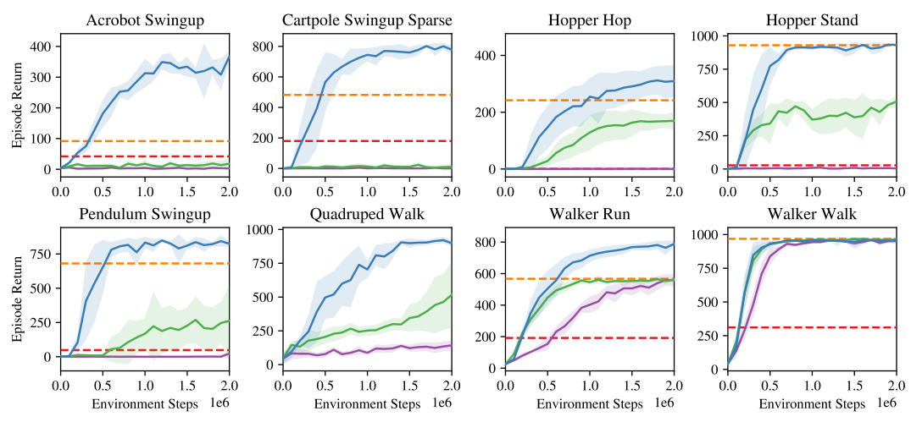

When most people hear Reinforcement Learning (RL), they usually think about some of the key works in the field such as [Deepmind's DQN playing Atari](https://arxiv.org/pdf/1312.5602.pdf), [OpenAI's robot hand solving Rubik's cube](https://arxiv.org/abs/1910.07113) or more recently Reinforcement Learning from Human Feedback (RLHF) that powers ChatGPT. All of these assume that they are operating in a Markov Decision Process (MDP) and we do no know (or can't model) the transition function. Algorithms with these assumptions are under the branch of Model-Free RL (MFRL). However, there is also another side called Model-Based RL (MBRL) which asks what can we do if we roughly knew the model? Although less popular, it offers sevaral exciting benefits and powers algorithms like [AlphaGo](https://www.nature.com/articles/nature16961).

In this blog post, we'll review MBRL and explore diffirent approaches.

**Table of contents**
* TOC
{:toc}

Problem
=================

In Reinforcement Learning we are concerned with obtaining the highest possible reward within a $T$-long episode following some $\theta$-parametarised policy $ a \sim \pi_\theta(\cdot \| s)$:

$$ \begin{equation} J(\theta) =  \sum_{t=0}^T \mathbb{E}_{\substack{  s_0 \sim \rho (s_0) \\ s_{t+1} \sim p(s_{t} | s_{t-1}, a_{t-1}) \\ a_t \sim \pi(a_t | s_t; \theta)}} \big[ r(s_t, a_t) \big] \end{equation} $$

As you have probably seen before, we can approximate the gradients of this using the Policy Gradients Theorem assuming some delta-dirac distribution $\rho(s_0)$:

$$ \begin{equation} \nabla_\theta J(\theta) = \mathbb{E}_{s_{t+1} \sim p(s_{t+1} | s_{t}, a_{t}) \atop a_t \sim \pi(a_t | s_t; \theta)} \bigg[ \sum_{t=0}^T r(s_t, a_t) \nabla_\theta \log \pi (a_t | s_t; \theta) \bigg] \end{equation}$$

It's impressive that this works! Most importantly this allows us to approximate gradients of any arbitrary complex problem just by Monte-Carlo sampling and knowing $\pi$. In other words we don't need to know the reward function $r(s,a)$ and the transition function $p(s_{t+1} \| s_t, a_t)$ (also known as "model" or "dynamics model"). This setting is called **Model-Free** Reinforcement Learning (MFRL).

However, what can we do if we knew the model in problems that we are very familiar with such as driving a car? This is the domain of **Model-Based** Reinforcement Learning (MBRL)

# MFRL vs MBRL

Possibly one of the biggest divisions and questions in the field of RL with no clear answer yet. As [Sutton notes in Section 1.7 of his book](http://incompleteideas.net/book/bookdraft2017nov5.pdf), historically there have been two parallel threads in the field of RL:

1. In the 1950s Richard Bellman conceptualised the ideas of dynamic programming by extending theory of Hamilton and Jacobi. In his foundational work (Bellman, 1957a), (Bellman 1957b) he formalised Markov Decision Problems (MDPs) and methods of solving them. These were the foundations of the field now known as **optimal control**. Largely an engineering field, researches concerned themselves mostly with physical dynamical systems such as cars and planes. Due to the safety-critical nature of these problems, the field leaned heavily on provable theoritical guarantees which often necessitated assuming that $f(\cdot)$ is known.
2. The other thread was inspired by the psychological phenomenon of trial-and-error learning in animals. As early in the 1940s, Alan Turing hypothesised that computers can learn like animals but it was only until (Widrow et al., 1973) that the first true algorithm was conceived that learned by trial-and-error aka. reinforcement. This inspired several researchers in **arteficial intelligence** to pursue what we now know as reinforcement learning without the necessity of knowing $f(\cdot)$. Some of the most notable early work was done by Harry Kopf (1972, 1975, 1992) Most of this line of work was targetting creating general computer intelligence and early on attempted tackling problems such as chess, blackjack and other games.

Then in 1989, Watkins treated reinforcement learning as an (MDP) and made the connection between and AI and optimal control fields which were later further strengthened by Dimitri Bertsekas and John Tsitsiklis (1996). Now in modern times, the fields are unified and the connections are clear and researchers regardless of problems would say that they are researching reinforcement learning. However, it is still clear to see that scientists in different communities approach their respective problems in different ways. Researchers concerning themselves with safety-critical systems still lean heavily on provable guarantees which often necessitates knowing (or learning) the model $f(\cdot)$. On the other hand, AI researchers often deal with problems in digital space and develop model-free algorithms that work well but lack any guarantees which is still OK if they aren't necessary. For example, it's OK if my spam filter works 95% of the time but it is not OK if my autonomous car only drives correctly 95% of the time.

> Note: that sometimes modeling $f(\cdot)$ is impossible (e.g. ChatGPT) and in such cases, model-free approaches are the only option.

Sticking to model-based, assuming we know $f(\cdot)$, what can we do better than model-free approaches?

# What model?

We've decided to go model-based, now where does $f(\cdot)$ come from? If we know the system and the world well, we can just define a physics model! On the other hand, we can also use any function approximation technique (*cough* neural nets) to learn the model from data in a supervised fasion. We call these types of models parametric and non-parametric respectively.

Let's look at a few examples of an autonomous vehicle driving. 

## Parametric models

If our robot/system is well-understood like a car, we have decades of research to lean on and derive a physics model. A simple one for a car is known as the kinematic bicycle model where we assume that the car is symettric and simplify it to two wheels. Furthermore, we assume that the tyres are solid and this gives us a very simple model:

$$\begin{align}
f(s, a) = \begin{pmatrix}
    x \\
    y \\
    \psi \\
    \delta \\
    \end{pmatrix} =
    \begin{pmatrix}
    v \cos(\delta + \psi)\\
    v \sin(\delta + \psi)\\
    \dfrac{v \tan(\delta) \cos(\beta)}{L}\\
    \theta
    \end{pmatrix}
\end{align}$$

where $s = (x,y, \theta, \delta)$ are position, oreintation and steering angle in 2D. Controls are $a = (v, \theta)$ velocity and steering rate (i.e. how fast we are turning the wheel). $\beta = \arctan(\dfrac{l_r \tan(\delta)}{L})$ is called the slip angle. This now leaves us with $L$ and $l_r$ which are the wheelbase and distance from center to rear axle of the car. These aren't generic and are car specific, meaning that every car has different values for $L$ and $l_r$. We call them parameters and they are crucial to make our model accurate. Sometimes we know what they are (e.g. wheelbase of a car), sometimes we don't and we have to figure it out from data via e.g. supervised learning. We actually call this [system identification](https://en.wikipedia.org/wiki/System_identification).

Parametric models can get extremely complex. F1 dynamics models have more than 200 parameters! The more complex we make a model the more difficult it gets to use it for reinfrocement learning.

This is cool, but what if we want to model the world around us? Pedestrians, buildings, other cars? That gets way more difficult. Most would say impossible.

## Non-parametric models

The other extreme of models is saying "let's throw physics out of the window and use a big neural net to learn everything". [David Ha et. al (2018)](https://worldmodels.github.io/) coined the term **world model** where they learn $f(s,a)$ using a RNN from past experiences in a completely self-supervised fashion. The kicker? They don't even need to define $s_t$, they just leave the network to figure it out by itself! This enables them to learn to play video games completely from camera images

World models enable us to learn any kind of model from any observation using the magic of neural nets and deceivingly simple loss functions such as:

$$ || f_\theta(s_1, a_{1:H-1}) - s_{2:H} ||_2^2 $$

where $H$ is some horizon, states and actions are sampled from a buffer and $f_\theta$ is a $\theta$-parametarised RNN that predicts the sequence of states $\hat{s}_{2:H} = f_\theta(s_1, a_{1:H-1})$.

Non-parametric models (or world models) are very powerful as demonstrated by [Hu et al, 2022](https://github.com/wayveai/mile)

Unfortunately, since they are based on neural nets, there are 0 safety guarantees and theoretical understanding of them. In practice they tend to overfit to their datasets and require a lot of data wrangling and various trick to get working reasonably well. Even then, as soon as you start operating outside of your training set, the models start to "hallucinate" false predictions about the future. Still an exciting area of research!

## Semi-parametric models

Finally, what stops us from combining parametric and non-parametric models? Model what we know and leave the neural nets to learn everything we don't know. That's exactly the idea of semi-parametric models!

$$f(s_t, a_t) = f_p(s_t, a_t) + f_{np}(\hat{s}_t, a_t)$$

where $\hat{s}_t = f(s_t,a_t)$ is the output of the parametric part of the model and $f_{np}$ is the non-parametric part of the model.

In my first paper [Georgiev et al, 2020](https://arxiv.org/abs/2011.08750) we showed that approaches like this bring the benefits of both worlds - generalisability and accuracy but still do not offer any guarantees. In other words, no safety proofs.

# Using the model

Let's assume a magical fairy has given us our model $f(s,a)$, what can we do with it? There seems to be no consensus on what is the best way and benefits/drawbacks vary per application. The best method also depends on what kind of model you are using. Thus here I will try to summarize my understanding of how model can be used.

> Note: these methods aren't in any way mutually exclusive. They are often combined into a larger coheisive system

One thing is common amongst all methods, they all aim to solve the objective of maximising reward

$$ \max_{a_0, a_1, ..., a_T} \sum_{t=0}^T r(s_t, a_t) $$

Some decide on a sequence of actions $(a_0, a_1, ... a_T)$, others learn a feedback policy $a_t = \pi(s_t) \quad \forall t \in [0,T]$.

## Sampling-based planning

Sampling-based approaches use the model to forward-sample into the future and decide what is the best course of action. In many ways, they go back to the basic objective of REINFORCE: 

$$ \begin{equation} \max_{a_0, a_1, ..., a_T} \sum_{t=0}^T \mathbb{E}_{s_{t+1} \sim p(s_{t} | s_{t-1}, a_{t-1}) \atop a_t \sim \pi(a_t | s_t; \theta)} \big[ r(s_t, a_t) \big] \end{equation} $$

where we take sample trajectories of our problem, estimate the cumulative reward and use that to iteratively figure out a sequence of best/optimal actions.

### Model Predictive Path Integral (MPPI) Control

MPPI was first introduced by [Willaims et al, 2015](https://drive.google.com/file/d/1tAgodZM6vSi_jemh-zMKOPSOfML9vx0r/view) and is considered a stochastic optimal control method with extensive theoretical foundations that I might expand on later. For brevity, it uses the model $f(s,a)$ to forward-sample thousnads of parallel trajectories, reward-wise average them according to $r(s,a)$ to iteratively optimize an action sequence $A := (a_0, a_1, ..., a_T)$. In pseudo code:

TODO make into an actual algorithm

* Given model $f(s,a)$
* Given reward function $r(s,a)$
* Given initial action sequence $A := (a_0, a_1, .., a_T)$
* Given some random noise $\epsilon$ (e.g. Gaussian)
* Given initial state $s_0$
* Repeat until convergence
  * Sample trajectories according to $S_n := (s_0, s_1, .., s_{T+1}) = f(s_0, A + \epsilon)$
  * Sample N trajectories: $S_1, S_2, ..., S_N$
  * Compute reward for each trajectory $R_n$ according to $r(s,a)$
  * For each timestep $t=0,..,T$
    - $a_t \leftarrow a_t + \sum_{n=1}^N \dfrac{a_{t,n} R_n}{\sum_k^N R_k}$ 

Here is a visual example of how MPPI works to control an autonomous racecar driving around a track. Notice how each of the samples trajectory is noisy but the final optimal one looks smooth.

MPPI doesn't learn a policy, instead it only optimizes a receeding horizon trajectory for a couple of seconds in front of the robot. Thus it has to plan a new trajectory every time it needs to act. In practice we often start with our best guess action sequence $A$ from our most recent optimization step.

TODO video of MPPI in action

### Monte Carlo Tree Search (MCTS)

TODO later since I don't need it for the class

## Model-based data generation

Another viewpoint of using the model is what if we used it to arteficially generate experience to train a policy from without interacting with the real world.

### Dyna

[Sutton, 1990](https://citeseerx.ist.psu.edu/viewdoc/download?doi=10.1.1.51.7362&rep=rep1&type=pdf) introduced a new approach for RL where we try to learn a policy $\pi$ to solve our environment. Assuming we had access to the model $f(s,a)$ and rewards $r(s,a)$, then we can do forward simulations and update the state-action values Q with

$$ Q(s_t,a_t) = r(s_t, a_t) + \gamma \sum_{t}^T f(s_t, a_t) \max_{a} Q(s_t,a) $$

In the discrete action space case, we can get a policy directly from Q. In the continuous action space, we can use policy-gradients methods to create $\pi$.

Things get even more interesting when we consider that we can learn $f(s_t, a_t)$ and $r(s_t, a_t)$ from interaction with the environment. That is exactly what Dyna does and can be roughly summarised to

Can we take this further? Yes!

### Dreamer

In several of their works Danijar et al. [(2019)](https://arxiv.org/pdf/1912.01603), [(2020)](https://arxiv.org/abs/2010.02193), [(2023)](https://arxiv.org/abs/2301.04104) propose the Dreamer family of algorithms. Opearting in the Dyna and world models domain, Dreamer aims to learn whole MDP, and then use the Dyna approach to learn an actor-critic architecture for solving a variety of tasks. To be more precise, it 5 different components:

* representation model $p(s_{t} | s_{t-1}, a_{t-1}, o_t)$ - learns to compress high-dim observations to low dimensional latents
* transition model $f(s_{t+1}|s_t,a_t)$
* reward model $r(s_t, a_t)$
* actor model $\pi(a_t| s_t)$
* critic model $v(s_t)$

The algorithm is then trained in stages (a) and (b), then deployed in stage (c):

Dreamer is pretty cool and can solve all kinds of tasks, rangning from robot manipulation, Atari games and now even the notoriously dificult minescraft task:

The MDP learning components of Dreamer aren't new and exciting. The critic can be learned in many fancy ways, but for now let's assume TD($\lambda$). What is most exciting though is the way the actor is learned! The actor simply aims to maximize the value of each visited state:

$$\max \mathbb{E} \big[ \sum_t^T V(s_t) \big] $$

Since this data is arteficially generated using all of our models, we can backpropagate through everything! Let's take an example where we differentiate wrt to $\hat{a}_1$:

Notice how we differentiate through both $r(s_t, a_t)$ and f(s_{t+1}|s_t,a_t)$. This makes our gradients more informed about the consequences of our actions in the long-term. This enables it to converge to an optimal policy much faster and more sample efficient than model-free approaches! Actually it needs the order of $10^3$ less samples!

When training the actor, Dreamer takes what we say analytical gradients of all of its models. Let's explore more approaches of this type.

## Analytic gradient computation

### Differential Dynamic Programming (DDP)

Differential Dynamic Programming (DDP), first proposed by [David Mayne in 1965](https://www.tandfonline.com/doi/abs/10.1080/00207176608921369) is one of the oldest trajectory optimization techniques in optimal control literature. It is an extension of Dynamic Programming where instead of optimising over the full state space, we are only optimise around a nominal trajectory by taking 2nd order Taylor approximations. Doing this repeatedly allows us to find local solutions of non-linear trajectory optimisation problems. Although simple in principle, it is a surprisingly powerful method which was more recently re-discovered and simplified into iLQR by [Tassa et al](https://homes.cs.washington.edu/~todorov/papers/TassaIROS12.pdf) and showcased in [complex humanoid behaviour](https://youtu.be/anIsw2-Lbco).

Similar to MPPI, it works in a receeding horizon fashion, where we assume we have a model and initiate the optimization with initial trajectory and aim to solve:

$$ \begin{equation} \max_{a_0, a_1, ..., a_T} \sum_{t=0}^T \mathbb{E}_{s_{t+1} \sim p(s_{t} | s_{t-1}, a_{t-1}) \atop a_t \sim \pi(a_t | s_t; \theta)} \big[ r(s_t, a_t) \big] \end{equation} $$

Here though we don't take samples but instead use the analytical gradients to optimize the best action sequence! This is similar to Dreamer but instead of learning a policy we optimize a sequence of actions. This is done by starting at the end of our rolled out trajectory and taking the analytical gradients through the dynamics and reward.

Vanilla DDP achieves this through the use of value functions:

$$\begin{aligned}
    V(s_N) &= \min_u \bigg[ r(s_N, a_N) + \sum_{k=N}^{N-1} r(s_k, a_k) \bigg] \\
    &= \min_a\bigg[ r(s_N) \bigg] = r(s_N) \\
    V(s_{N-1}) &= \min_{a_n} \bigg[ r(s_{N-1}, a_n) + V(s_N, t_N) \bigg] \\
    \vdots \\
    V(s_0) &= \min_a\bigg[ r(s_0, a_0) + V(s_1, t_1) \bigg]\end{aligned}$$

We repeat this process until convergence and iteratively get better and better trajectories

If you are interested more, I have a full [blog post on deriving DDP](http://www.imgeorgiev.com/2023-02-01-ddp/).

DDP is cool but unfortunately limited to receeding horizons and is most often used with known parametric models. What if we want to bring it into the 21st century and make it more scalable?

### Short Horizon Actor Critic (SHAC)

Now that you've learned about analytical gradients through dynamics and rewards, you're probably asking yourself, why don't we use those in simulations?

<video width="240" height="240" autoplay loop muted>
  <source type="video/mp4" src="../img/blog/2023-06-27-sac/sac_humanoid.mp4">
</video>

It's easier to create such simulations than it is to backpropagate through them. The reason? **Contact**! Physical contact is considered largely non-differentiatable. Luckily, there has been extensive research on how we can smooth out such contact and make it differentiable.

Consider the Heaviside function

$$H(t) = \begin{cases} 1 & t \geq 0 \\ 0 &t < 0 \end{cases}$$

Naturally $\nabla H(0)$ is undefined but we can smooth out the function t make it differentaible

$$ H(t) \approx \dfrac{1}{2} + \dfrac{1}{2} \tanh k t$$

This is now differentiable and approximately correct!

In a similar fashion (with more complex model) we can approximate contact in simulation and make the whole simulator differentiable! We call these types of simulations differentiable simulators (DiffSim) and when implemented efficiently on a GPU, they are an engineering marvel! A good example is Nvidia's [warp](https://github.com/NVIDIA/warp).

This is cool, but what can we do with it? [Xu et al, 2022](https://short-horizon-actor-critic.github.io/) showed that we can use them to learn locomotion policies really fast on a single GPU. That humanoid that can barely walk above? It can now learn to run in just 40 minutes of training!

The algorithm behind this is called Short Horizon Actor Critic (SHAC) and is capable of tackling problems of high complexity. As suggested by the name it has two components, a critic and an actor. 

The overall training loop of the algorithm is

1. Sample a short horizon of $H=32$ timesteps of N parallel environments
2. Update critic neural network via a TD($\lambda$) update $\hat{V}(s_t) = (1-\lambda) \bigg( \sum_{k=1}^{H-t-1} \lambda^{h-t-1} G_t^{h-t} \bigg) + \lambda^{h-t-1} G_t^{h-t}$ where $G_t^k = \big( \sum_{l=0}^{k-1} \gamma^l r_{t+l} \big) + \gamma^k V_\phi (s_{t+k})$
3. Update actor via the loss function $L_\theta = -\dfrac{1}{N H} \sum_{i=1}^N \bigg[ \big( \sum_{t=t_0}^{t_0 + h -1} \gamma^{t - t_0} r(s_t^i, a_t^i) \big) + \gamma^h V_\phi (s_{t_0 +h}^i)\bigg]$

# Refernces

# Further resources

# Acknowledgements

**If you have any comments or suggestions, [shoot me an email](mailto:ignat@imgeorgiev.com)!**

