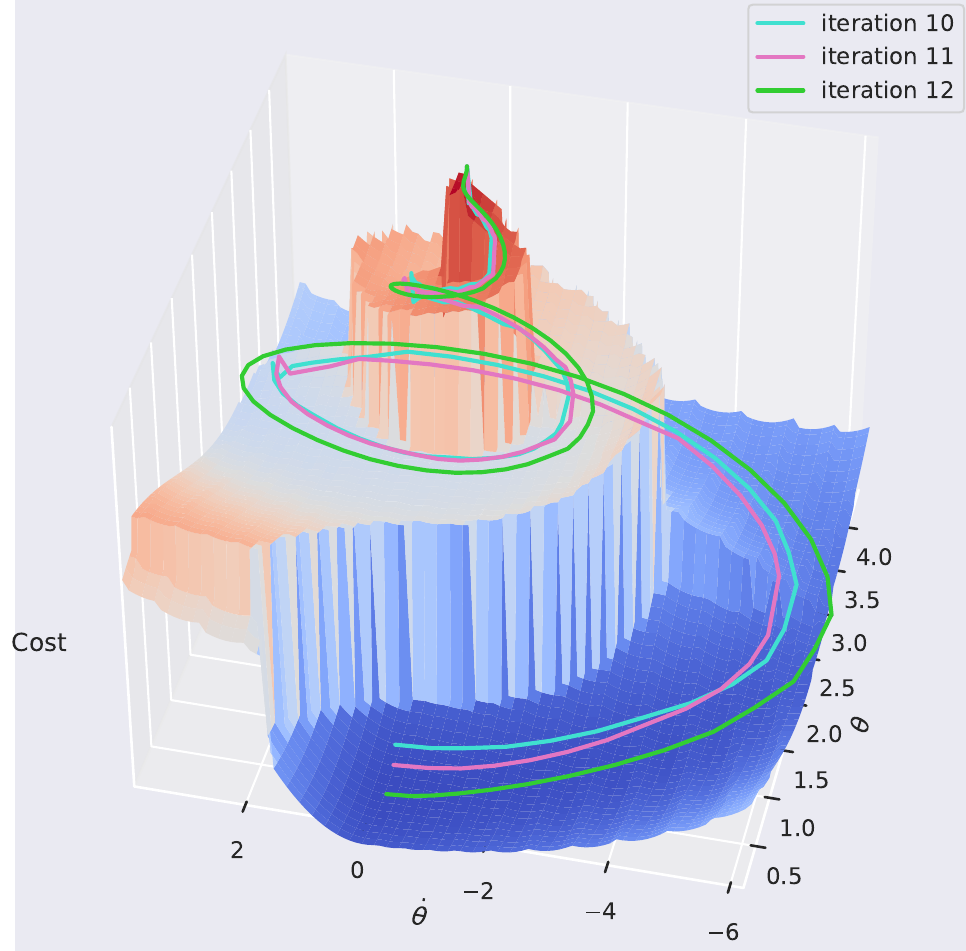

When most people hear Reinforcement Learning (RL), they usually think about some of the key works in the field, such as [Deepmind's DQN playing Atari](https://arxiv.org/pdf/1312.5602.pdf), [OpenAI's robot hand solving Rubik's cube](https://arxiv.org/abs/1910.07113) or more recently, Reinforcement Learning from Human Feedback (RLHF) that powers ChatGPT. All of these assume that they are operating in a Markov Decision Process (MDP), and we do not know (or can't model) the transition function. Algorithms with these assumptions are in the Model-Free RL (MFRL) branch. However, there is also another side called Model-Based RL (MBRL), which asks: What can we do if we roughly know the model? Although less popular, it offers many exciting benefits and powers algorithms like [AlphaGo](https://www.nature.com/articles/nature16961).

In this blog post, we'll review MBRL and explore diffirent approaches.

**Table of contents**
* TOC
{:toc}

Problem
=================

In Reinforcement Learning, we are concerned with obtaining the highest possible reward within a $T$-long episode following some $\theta$-parametarised policy $ a \sim \pi_\theta(\cdot \| s)$:

$$ \begin{equation} J(\theta) = \mathbb{E}_{\substack{ s_0 \sim \rho (s_0) \\ s_{t+1} \sim p( \cdot | s_t, a_t) \\ a_t \sim \pi(a_t | s_t; \theta)}} \big[ \sum_{t=0}^T r(s_t, a_t) \big] \end{equation} $$

As you have probably seen before, we can approximate the gradients of this using the Policy Gradients Theorem, assuming some delta-dirac distribution $\rho(s_0)$:

$$ \begin{equation} \nabla_\theta J(\theta) = \mathbb{E}_{s_{t+1} \sim p(s_{t+1} | s_{t}, a_{t}) \atop a_t \sim \pi(a_t | s_t; \theta)} \bigg[ \sum_{t=0}^T r(s_t, a_t) \nabla_\theta \log \pi (a_t | s_t; \theta) \bigg] \end{equation}$$

It's impressive that this works! Most importantly, this allows us to approximate the gradients of any arbitrary complex problem just by Monte-Carlo sampling and knowing $\pi$. In other words, we don't need to know the reward function $r(s,a)$ and the transition function $p(s_{t+1} \| s_t, a_t)$ (also known as "model" or "dynamics model"). This setting is called **Model-Free** Reinforcement Learning (MFRL).

However, what can we do if we know the model for problems that we are very familiar with, such as driving a car? This is the domain of **Model-Based** Reinforcement Learning (MBRL). For the remainder of the blog post, we will denote the transition function as a deterministic function: $s_{t+1} = f(s_t, a_t)$.

# MFRL vs MBRL

Possibly one of the biggest divisions and questions in the field of RL with no clear answer yet. As [Sutton notes in Section 1.7 of his book](http://incompleteideas.net/book/bookdraft2017nov5.pdf), historically there have been two parallel threads in the field of RL:

1. In the 1950s Richard Bellman conceptualized the ideas of dynamic programming by extending the theories of Hamilton and Jacobi. In his foundational work (Bellman, 1957a), (Bellman 1957b) he formalized Markov Decision Problems (MDPs) and methods of solving them. These were the foundations of the field now known as **optimal control**. Largely an engineering field, researchers concern themselves mostly with physical dynamical systems such as cars and planes. Due to the safety-critical nature of these problems, the field leaned heavily on provable theoretical guarantees, which often necessitated assuming that $f(\cdot)$ is known.
2. The other thread was inspired by the psychological phenomenon of trial-and-error learning in animals. As early as the 1940s, Alan Turing hypothesized that computers could learn like animals, but it was only until (Widrow et al., 1973) that the first true algorithm was conceived: learning by trial-and-error, aka. reinforcement. This inspired several researchers in **arteficial intelligence** to pursue what we now know as reinforcement learning without the necessity of knowing $f(\cdot)$. Some of the most notable early work was done by Harry Kopf (1972, 1975, 1992) Most of this line of work focused on creating general computer intelligence and, early on, attempted to tackle problems such as chess, blackjack, and other games.

Then, in 1989, Watkins treated reinforcement learning as an (MDP) and made the connection between AI and optimal control fields, which were later further strengthened by Dimitri Bertsekas and John Tsitsiklis (1996). In modern times, the fields are unified, the connections are clear, and researchers, regardless of problems, would say that they are researching reinforcement learning. However, it is still clear to see that scientists in different communities approach their respective problems in different ways. Researchers concerned themselves with safety-critical systems still lean heavily on provable guarantees, which often necessitate knowing (or learning) the model $f(\cdot)$. On the other hand, AI researchers often deal with problems in the digital space and develop model-free algorithms that work well but lack any guarantees, which is still OK if they aren't necessary. For example, it's OK if my spam filter works 95% of the time, but it is not OK if my autonomous car only drives correctly 95% of the time.

> Note: Sometimes modeling $f(\cdot)$ is impossible (e.g., ChatGPT), and in such cases, model-free approaches are the only option.

Sticking to model-based approaches, assuming we know $f(\cdot)$, what can we do better than model-free approaches?

# What model?

We've decided to go model-based; now where does $f(\cdot)$ come from? If we know the system and the world well, we can just define a physics model! On the other hand, we can also use any function approximation technique (*cough* neural nets) to learn the model from data in a supervised fashion. We call these types of models parametric and non-parametric, respectively.

Let's look at a few examples of an autonomous vehicle driving.

## Parametric models

If our robot or system is well understood, like a car, we have decades of research to lean on and derive a physics model. A simple one for a car is known as the kinematic bicycle model, where we assume that the car is symetric and simplify it to two wheels. Furthermore, we assume that the tires are solid, and this gives us a very simple model:

$$\begin{align}
f(s, a) = \begin{pmatrix}
x \\
y \\
\psi \\
\delta \\
\end{pmatrix} =
\begin{pmatrix}
v \cos(\delta + \psi)\\
v \sin(\delta + \psi)\\
\dfrac{v \tan(\delta) \cos(\beta)}{L}\\
\theta
\end{pmatrix}
\end{align}$$

where $s = (x,y, \theta, \delta)$ are position, orientation, and steering angle in 2D. Controls are $a = (v, \theta)$ velocity and steering rate (i.e., how fast we are turning the wheel). $\beta = \arctan(\dfrac{l_r \tan(\delta)}{L})$ is called the slip angle. This now leaves us with $L$ and $l_r$, which are the wheelbase and distance from the center to the rear axle of the car. These aren't generic and are car-specific, meaning that every car has different values for $L$ and $l_r$. We call them parameters, and they are crucial to making our model accurate. Sometimes we know what they are (e.g., the wheelbase of a car), sometimes we don't, and we have to figure it out from data via, e.g., supervised learning. This topic of fitting a parametric physics model to data is called [system identification](https://en.wikipedia.org/wiki/System_identification).

Parametric models can get extremely complex. F1 dynamics models have more than 200 parameters! The more complex we make a model, the more accurate it gets, but it is also more difficult to use it for MBRL.

This is cool, but what if we want to model the world around us? Pedestrians, buildings, other cars? That gets way more difficult. Most would say impossible.

## Non-parametric models

The other extreme of models is saying "Let's throw physics out of the window and use a big neural net to learn everything". [David Ha et al. (2018)](https://worldmodels.github.io/) coined the term **world model** where they learn $f(s,a)$ using a RNN from past experiences in a completely self-supervised fashion. The kicker? They don't even need to define $s_t$; they just leave the network to figure it out by itself! This enables them to learn to play video games completely from camera images.

*World models explained by [David Ha et al. (2018)](https://worldmodels.github.io/).*

World models enable us to learn any kind of model from any observation using the magic of deep learning and deceivingly simple loss functions such as:

$$ || f_\theta(s_1, a_{1:H-1}) - s_{2:H} ||_2^2 $$

where $H$ is some horizon, states and actions are sampled from a buffer, and $f_\theta$ is a $\theta$-parametarised RNN that predicts the sequence of states $$\hat{s}_{2:H} = f_\theta(s_1, a_{1:H-1})$$.

When world models are made with generative models, they become immensely powerful, as demonstrated by [Hu et al, (2022)](https://github.com/wayveai/mile)!

*World models imagining future possibilities for an autonomous car [Hu et al., (2022)](https://github.com/wayveai/mile).*

These types of models are super exciting and show promise for powering the future of robotics. However, we are yet to see how robust they are in the real world.

## Semi-parametric models

Finally, what stops us from combining parametric and non-parametric models? Model what we know and leave the neural nets to learn everything we don't know. That's exactly the idea of semi-parametric models!

$$f(s_t, a_t) = f_p(s_t, a_t) + f_{np}(\hat{s}_t, a_t)$$

where $\hat{s}_t = f(s_t,a_t)$ is the output of the parametric part of the model and $f_{np}$ is the non-parametric part of the model.

In my first paper [Georgiev et al, 2020](https://arxiv.org/abs/2011.08750) we showed that approaches like this bring the benefits of both worlds - generalisability and accuracy but still do not offer any guarantees. In other words, no safety proofs.

# Using the model

Let's assume a magical fairy has given us our model, $f(s,a). What can we do with it? There seems to be no consensus on what is the best way, and benefits and drawbacks vary per application. The best method also depends on what kind of model you are using. Thus, here I will try to summarize my understanding of how models can be used.

## Sampling-based planning

Sampling-based approaches use the model to forward-sample into the future and decide what the best course of action is. In many ways, they go back to the basic objective of REINFORCE, but instead of optimizing for a feedback policy, we now optimize for a sequence of actions $A :=(a_0, a_1, ... a_T)$:

$$ \begin{equation} \max_{a_0, a_1, ..., a_T} \mathbb{E}_{s_{t+1} \sim p(s_{t} | s_t, a_t) \atop a_t \sim \pi(a_t | s_t; \theta)} \big[ \sum_{t=0}^T r(s_t, a_t) \big] \end{equation} $$

In this setting, we take sample trajectories of our problem, estimate the cumulative reward, and use that to iteratively figure out a sequence of the best actions.

### Model Predictive Path Integral (MPPI)

MPPI was first introduced by [Willaims et al., 2015](https://drive.google.com/file/d/1tAgodZM6vSi_jemh-zMKOPSOfML9vx0r/view) and is considered a stochastic optimal control method with extensive theoretical foundations that I might expand on later. For brevity, it uses the model $f(s,a)$ to sample thousnads of parallel trajectories and reward-wise average them according to $r(s,a)$ to iteratively optimize an action sequence $A$. In the pseudocode below, I use the shorthand notation for a trajectory sample: $S_n := (s_0, s_1, .., s_{T+1}) = f(s_0, A + \epsilon)$:

* Given model $f(s,a)$
* Given reward function $r(s,a)$
* Given initial action sequence $A := (a_0, a_1, .., a_T)$
* Given some random noise $\epsilon$ (e.g. Gaussian)
* Given initial state $s_0$
* Repeat until convergence:
* Sample N trajectories: $S_1, S_2, ..., S_N \sim f(s_0, A + \epsilon)$
* Compute reward for each trajectory $R_n = \sum_{t=0}^T r(s_t, a_t)$
* For each timestep $t=0,..,T$
- $a_t \leftarrow a_t + \sum_{n=1}^N \dfrac{a_{t,n} R_n}{\sum_k^N R_k}$

Here is a visual example of how MPPI works to control an autonomous racecar driving around a track. Notice how each of the sample trajectories are noisy, but the final optimal one looks smooth.

*Visualization of MPPI for an autonomous car taken from my MSc thesis. Here I use cost, but you can think of it as the inverse of reward.*

MPPI doesn't learn a policy; instead, it only optimizes a receding horizon trajectory for a couple of seconds in front of the robot. Thus, it has to plan a new trajectory every time it needs to act. In practice, we often start with our best-guessed action sequence $A$ from our most recent optimization step.

MPPI has been shown to do some aggressive (and dynamically complex) autonomous driving](https://youtu.be/1AR2-OHCxsQ?si=S8lZK8fC7bwgkCyU) and if you are interested, here are some further resources](https://sites.gatech.edu/acds/mppi/).

### Monte Carlo Tree Search (MCTS)

Instead of brute-force rolling out many trajectories in parallel, we can view these model-based rollouts as a tree and use Monte Carlo Tree Search (MCTS) to do informed searching.

MCTS uses Monte Carlo simulation to accumulate value estimates to guide highly rewarding trajectories in the search tree. In other words, MCTS pays more attention to nodes that are more promising, so it avoids having to brute force all possibilities, which is impractical to do.

*MCTS is visualized from the [wikipedia page](https://en.wikipedia.org/wiki/Monte_Carlo_tree_search).*

Now the key question is: how do we do the "Simulation" step? You probably guessed it: we can use our model! As a matter of fact, that is what [Silver et al. (2017)](https://www.nature.com/articles/nature16961) do in their famous AlphaGo paper! They train a neural network to learn the model (dynamics) of the problem and a critic to estimate the values at intermediate steps!

If you want to learn more about critics (and actor-critic methods), you can check out [my blog post on SAC](https://www.imgeorgiev.com/2023-06-27-sac/)!

Let's put planning aside for a moment...

## Model-based data generation

Possibly the simplest way to use a model is to generate new simulated experiences with it and still use our typical model-free tricks to learn a policy. The magic here is that we have to interact less with the real world, thus increasing our sample efficiency.

### Dyna / MBPO

[Sutton, 1990](https://citeseerx.ist.psu.edu/viewdoc/download?doi=10.1.1.51.7362&rep=rep1&type=pdf) introduced a new approach for RL where we try to learn a policy $\pi$ to solve our environment. Assuming we had access to the model $f(s,a)$ and rewards $r(s,a)$, then we could do forward simulations and update the state-action values Q with

$$ Q(s_t,a_t) = r(s_t, a_t) + \gamma \sum_{t}^T f(s_t, a_t) \max_{a} Q(s_t,a) $$

In the discrete action space case, we can get a policy directly from Q. In the continuous action space, we can use policy-gradients methods to learn $\pi$.

Things get even more interesting when we consider that we can learn $f(s_t, a_t)$ and $r(s_t, a_t)$ from interaction with the environment. That is exactly what [Jenner et al. (2019)](https://bair.berkeley.edu/blog/2019/12/12/mbpo/) do in their MBPO algorithm:

*MBPO high-level algorithm*

This method is super simple yet gives us superior sample efficiency if we can learn a good model $f(\cdot)$.

### Dreamer

In several of their works Danijar et al. [(2019)](https://arxiv.org/pdf/1912.01603), [(2020)](https://arxiv.org/abs/2010.02193), [(2023)](https://arxiv.org/abs/2301.04104) propose the Dreamer family of algorithms. Opearting in the Dyna and world models domains, Dreamer aims to learn the whole MDP, and then use the Dyna approach to learn an actor-critic architecture for solving a variety of tasks. Unlike most other approaches we have considered so far, Dreamer naturally operates on RGB observations of the world labeled as $o_t$. To make efficient usage of that it learns to compress images to latent observations. In particular, Dreamer has 5 different components.

* representation model $p(s_{t} \| s_{t-1}, a_{t-1}, o_t)$ - learns to compress high-dim observations into low-dimensional latents
* transition model $f(s_{t+1} \| s_t,a_t)$
* reward model $r(s_t, a_t)$
* actor model $\pi(a_t \| s_t)$
* critic model $v(s_t)$

The algorithm is then trained in stages (a) and (b), then deployed in stage (c):

*Dreamer training loop taken from the original paper by [Danijar et al. (2019)](https://arxiv.org/pdf/1912.01603)*

Dreamer is pretty cool and can solve all kinds of tasks, ranging from robot manipulation, Atari games, and now even the notoriously difficult Minecraft task:

The MDP learning components of Dreamer aren't new or exciting. The critic can be learned in many fancy ways, but for now, let's assume TD($\lambda$). What is most exciting, though, is the way the actor is learned!

Since this data is artificially generated using all of our models, we can backpropagate through everything! Let's take an example where we differentiate with respect to $\hat{a}_1$. In the diagram below, the blue arrows indicate how gradients flow back from the rewards and values to $\hat{a}_1$. This so-called backpropagation through time is using first-order gradients instead of the Policy Gradients Theorem to learn better policies (and do that faster!).

*Visualization of how gradeints flow when differentiating with respect to $\hat{a}_1$*

Notice how we differentiate through both $r(s_t, a_t)$ and $f(s_{t+1} \|s_t,a_t)$. This makes our gradients more informed about the consequences of our actions in the long term. This enables it to converge to an optimal policy much faster and more sample-efficiently than model-free approaches! Actually, it needs an order of $10^3$ less samples!

When training the actor, Dreamer takes what we call the first-order gradients of all of its models. Let's explore more approaches of this type!

## First-Order Methods

Instead of using the Policy Gradients Theorem to train a policy, these methods, like Dreamer, backpropagate gradients through time (i.e., through the transition function) in order to obtain more accurate gradient samples. This enables more efficient and faster policy training.

### Differential Dynamic Programming (DDP)

Differential Dynamic Programming (DDP), first proposed by [David Mayne in 1965](https://www.tandfonline.com/doi/abs/10.1080/00207176608921369) is one of the oldest trajectory optimization techniques in optimal control literature. It is an extension of Dynamic Programming where, instead of optimizing over the full state space, we only optimize around a nominal trajectory by taking 2nd-order Taylor approximations. Doing this repeatedly allows us to find local solutions to non-linear trajectory optimization problems. Although simple in principle, it is a surprisingly powerful method that was more recently re-discovered and simplified into iLQR by [Tassa et al](https://homes.cs.washington.edu/~todorov/papers/TassaIROS12.pdf) and showcased in [complex humanoid behaviour](https://youtu.be/anIsw2-Lbco).

Similar to MPPI, it works in a receding-horizon fashion, where we assume we have a model, initiate the optimization with an initial trajectory, and aim to solve:

$$ \begin{equation} \max_{a_0, a_1, ..., a_T} \mathbb{E}_{s_{t+1} \sim p(\cdot | s_t, a_t) \atop a_t \sim \pi(\cdot | s_t; \theta)} \big[ \sum_{t=0}^T r(s_t, a_t) \big] \end{equation} $$

Here, though, we don't take samples but instead use the analytical gradients to optimize the best action sequence! This is similar to Dreamer, but instead of learning a policy, we optimize a sequence of actions. This is done by starting at the end of our rolled-out trajectory and taking the analytical gradients through the dynamics and reward.

Vanilla DDP achieves this through the use of value functions going backwards through time $T, T-1, ..., 0$:

$$\begin{aligned}
V(s_T) &= \min_a \bigg[ r(s_T) + \sum_{k=T}^{T-1} r(s_k, a_k) \bigg] \\
&= \min_a\bigg[ r(s_T) \bigg] = r(s_T) \\
V(s_{T-1}) &= \min_{a_t} \bigg[ r(s_{T-1}, a_t) + V(s_T, t_T) \bigg] \\
\vdots \\
V(s_0) &= \min_{a_0} \bigg[ r(s_0, a_0) + V(s_1, t_1) \bigg]\end{aligned}$$

We repeat this process until convergence and iteratively get better and better trajectories:

*Visualization of DDP optimization iterations*

If you are interested more, I have a full [blog post on deriving DDP](http://www.imgeorgiev.com/2023-02-01-ddp/).

DDP is cool but unfortunately limited to receding horizons and is most often used with known parametric models. What if we want to bring it into the 21st century and make it more scalable?

> Note: The original DDP algorithm actually takes 2nd-order gradients, making it one-level deeper than 1st-order methods, but a good showcase none the less.

### Short Horizon Actor Critic (SHAC)

Now that we've learned about first-order gradients through dynamics and rewards, you're probably asking yourself, Why don't we use those in simulations? We do a lot of RL in simulation, right?

<video width="240" height="240" autoplay loop muted>
<source type="video/mp4" src="../img/blog/2023-06-27-sac/sac_humanoid.mp4">
</video>

It's easier to create such simulations than it is to backpropagate through them. The reason? **Contact**! Physical contact is highly discontinuous and, therefore, non-differentiable. Luckily, there has been extensive research on how we can smooth out such contact and make it differentiable.

Consider the Heaviside function:
$$H(t) = \begin{cases} 1 & t \geq 0 \\ 0 &t < 0 \end{cases}$$

Naturally, $\nabla H(0)$ is undefined, but we can smooth out the function to make it differentiable:

$$ H(t) \approx \dfrac{1}{2} + \dfrac{1}{2} \tanh k t$$

This is now differentiable and approximately correct!

*Taken from Wikipedia*

In a similar fashion (with a more complex model), we can approximate contact in simulation and make the whole simulator differentiable! We call these types of simulations **differentiable simulators** and when implemented efficiently on a GPU, they are an engineering marvel! A good example is Nvidia's [warp](https://github.com/NVIDIA/warp).

This is cool, but what can we do with it? [Xu et al., 2022](https://short-horizon-actor-critic.github.io/) showed that we can use them to learn locomotion policies really fast on a single GPU. That humanoid that can barely walk above? It can now learn to run in just 40 minutes of training!

*Taken from the SHAC website of [Xu et al, 2022](https://short-horizon-actor-critic.github.io/)*

The algorithm behind this is called Short Horizon Actor Critic (SHAC) and is capable of tackling problems of high complexity. As suggested by the name, it has two components: a critic and an actor ([see my other blog post if you want to learn more about actor-critic methods](https://www.imgeorgiev.com/2023-06-27-sac/)).

The actor objective is a first-order one:

$$J(\theta) := \sum_{h=t}^{t+H-1} \gamma^{h-t} r(s_h, a_h) + \gamma^t V_\psi(s_{t+T})$$

and the critic objective is TD($\lambda$):

$$\begin{align*}
R_h(s_t) := \sum_{n=t}^{t+h-1} \gamma^{n-t} r(s_n, a_n) + \gamma^{t+h} V_\phi (s_{t+h}) \\
\hat{V}(s_t) := (1-\lambda) \bigg[ \sum_{h=1}^{H-t-1} \lambda^{h-1} R_h(s_t) \bigg] + \lambda^{H-t-1} R_H(s_t) \\
\mathcal{L}(\psi) := \sum_{h=t}^{t+H} ||V_\psi(s_h) - \hat{V}(s_h)||_2^2
\end{align*}$$

The overall training loop of the algorithm is then relatively simple:

What are SHAC and differentiable simulation useful for? They allow us to easily create models for MBRL and train policies incredibly fast! They've also shown that they train asymptotically more optimal policies, but that is a topic for another day.

# Takeways

The key takeaways I want you to get from this blog post are:
1. Unlike MFRL, Model-based methods aim to model the world and harness that to improve things.
2. Most notably, MBRL is significantly more sample-efficient than MFRL. This makes it a prime candidate for real-world deployment where data is often limited.
3. The model allows us to plan for the future and reason about the consequences of our actions.
4. In some limited cases, the model allows us to obtain some theoretical guarantees about convergence.

# Refernces

1. [Playing Atari with Deep Reinforcement Learning (2013)](https://arxiv.org/pdf/1312.5602.pdf)
2. [Solving Rubik's Cube with a Robot Hand (2019)](https://arxiv.org/abs/1910.07113)
3. [Mastering the game of Go with deep neural networks and tree search](https://www.nature.com/articles/nature16961)
4. [Reinforcement Learning An Introduction by Sutton](http://incompleteideas.net/book/bookdraft2017nov5.pdf)
5. [Wiki page on system identification](https://en.wikipedia.org/wiki/System_identification)
6. [World Models](https://worldmodels.github.io/)
7. [Model-Based Imitation Learning for Urban Driving](https://github.com/wayveai/mile)
8. [Iterative Semi-parametric Dynamics Model Learning For Autonomous Racing](https://arxiv.org/abs/2011.08750)
9. [Aggressive Driving with Model Predictive Path Integral Control](https://drive.google.com/file/d/1tAgodZM6vSi_jemh-zMKOPSOfML9vx0r/view)
10. [Wiki page on Monte Carlo Tree Search (MCTS)](https://en.wikipedia.org/wiki/Monte_Carlo_tree_search)
11. [Integrated Architectures for Learning, Planning, and Reacting Based on Approximating Dynamic Programming](https://citeseerx.ist.psu.edu/viewdoc/download?doi=10.1.1.51.7362&rep=rep1&type=pdf)
12. [When to Trust Your Model: Model-Based Policy Optimization](https://arxiv.org/pdf/1906.08253.pdf)
13. [Dream To Control: Learning Behavriour By Latent Imagination](https://arxiv.org/pdf/1912.01603.pdf)
14. [A Second-order Gradient Method for Determining Optimal Trajectories of Non-linear Discrete-time Systems](https://www.tandfonline.com/doi/abs/10.1080/00207176608921369)
15. [Deriving Differential Dynamic Porgramming](https://www.imgeorgiev.com/2023-02-01-ddp/)
16. [Deriving Soft Actor Critic (SAC)](https://www.imgeorgiev.com/2023-06-27-sac/)
17. [Accelerated Policy Learning with Parallel Differentiable Simulation](https://short-horizon-actor-critic.github.io/)

# Further resources

1. [A Survey on Model-based Reinforcement Learning
](https://arxiv.org/abs/2206.09328)

**If you have any comments or suggestions, [shoot me an email](mailto:ignat@imgeorgiev.com)!**

