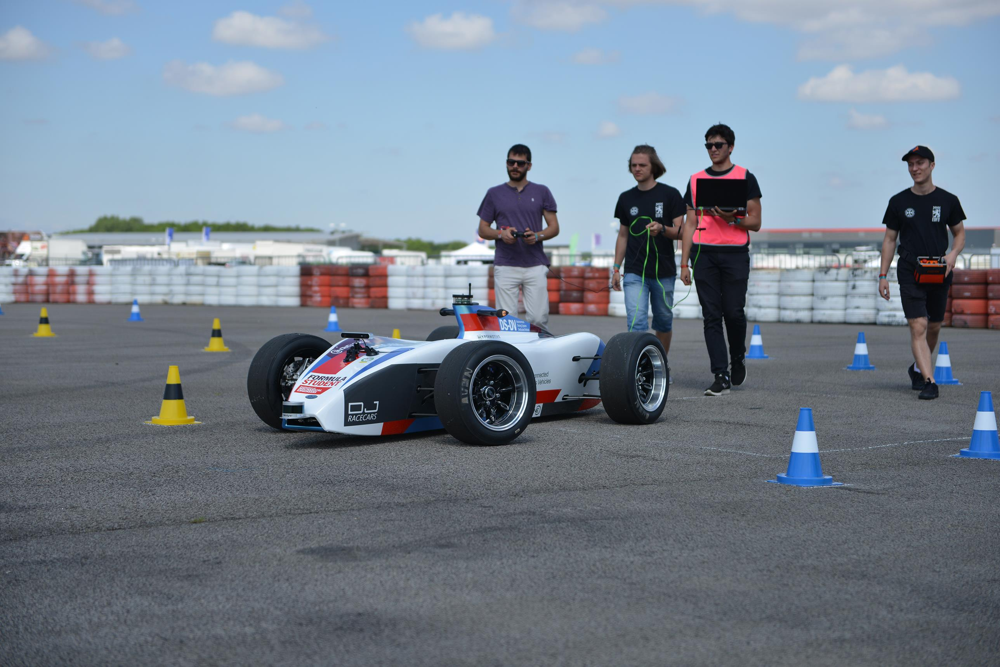
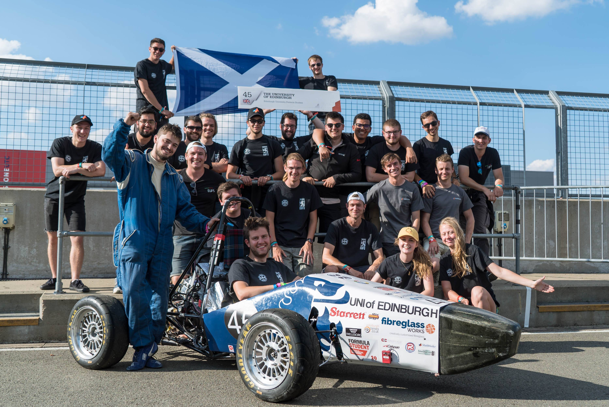

This is a collection of some personal projects I've worked on that are easily viewable online. Anything that is not browser-friendly will not make the cut :(

## Formula Student
For the majority of my time at University I have been involved with Edinburgh University Formula Student whose aim is to provide undergraduate students with the opportunity to design and build a single-seat racecar for a compeition and get a bunch of experience along the way. My main contribution to that is the founding the Autonomous branch of the team which addressed the new competition format - Formula Student Drierless challening students to develop a fully autonomous racecar. Within a single year, I gathered a team of talented students from the University of Edinburgh with which we developed the self-driving software and attended the Formula Student UK 2018 competition. We succesfully uploaded our software to the vehicle provided by the competition organisers and successfully completed an autonomous lap.

 

You can read more about this story at [the University article about us](https://www.ed.ac.uk/informatics/news-events/stories/2018/students-on-quest-for-high-speed-success) or at the [team webpage](http://eufs.eusa.ed.ac.uk)

## Python courses

